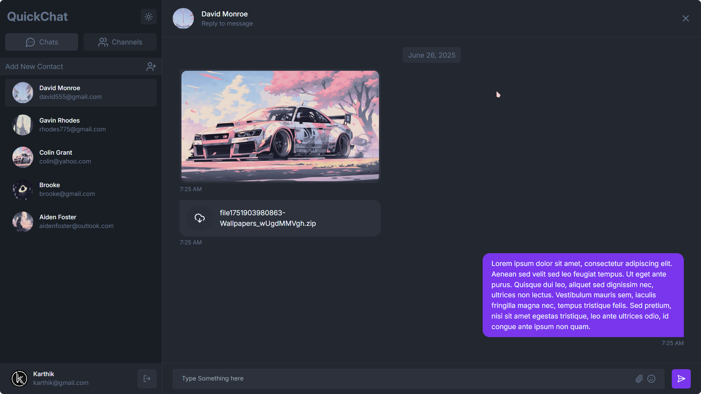

<h1 align="center">💬 QuickChat - Real-time Chat App</h1>

<div align="center" style="display:flex; gap:4px">
  

  

  

  

  

  
  
  
</div>

###



## 🚀 Features

-   ✅ User Authentication
-   🔐 Protected Routes
-   👥 Direct Messaging
-   🌐 Group Chat Support
-   📤 Media Sharing
-   📱 Responsive UI
-   🔔 Real-time Message Delivery with Socket.IO
-   🎨 Light theme and Dark theme Support

## 📁 Project Structure

<details>
<summary>Project Structure (Click to Expand)</summary>

```bash
📦 ChatApp
 ├── client
 │   ├── .env
 │   ├── index.html
 │   ├── jsconfig.json
 │   ├── package.json
 │   ├── package-lock.json
 │   ├── eslint.config.js
 │   ├── postcss.config.js
 │   ├── tailwind.config.js
 │   ├── vite.config.js
 │   ├── public
 │   │   └── favicon.png
 │   └── src
 │       ├── main.jsx
 │       ├── App.jsx
 │       ├── index.css
 │       ├── assets
 │       │   └── login.png
 │       ├── components
 │       │   ├── Avatar.jsx
 │       │   ├── Modal.jsx
 │       │   └── ThemeToggle.jsx
 │       ├── contexts
 │       │   ├── SocketContext.jsx
 │       │   └── ThemeContext.jsx
 │       ├── lib
 │       │   ├── axios.js
 │       │   ├── routes.js
 │       │   └── toast.js
 │       ├── pages
 │       │   ├── auth
 │       │   │   ├── Login.jsx
 │       │   │   └── Signup.jsx
 │       │   ├── chat
 │       │   │   ├── components
 │       │   │   │   ├── ChatContainer.jsx
 │       │   │   │   ├── ChatHeader.jsx
 │       │   │   │   ├── ChatInput.jsx
 │       │   │   │   ├── ChatMessages.jsx
 │       │   │   │   ├── ContactList.jsx
 │       │   │   │   ├── ContactsContainer.jsx
 │       │   │   │   ├── ContactSelector.jsx
 │       │   │   │   ├── EmptyChat.jsx
 │       │   │   │   ├── NewChannel.jsx
 │       │   │   │   └── NewDM.jsx
 │       │   │   └── Index.jsx
 │       │   └── profile
 │       │       └── Profile.jsx
 │       └── store
 │           ├── slices
 │           │   ├── authSlice.js
 │           │   └── chatSlice.js
 │           └── store.js
 └── server
     ├── .env
     ├── index.js
     ├── socket.js
     ├── package.json
     ├── package-lock.json
     ├── controllers
     │   ├── AuthController.js
     │   ├── ChannelController.js
     │   ├── ContactController.js
     │   └── MessageController.js
     ├── middleware
     │   └── AuthMiddleware.js
     ├── models
     │   ├── ChannelModel.js
     │   ├── MessageModel.js
     │   └── UserModel.js
     ├── routes
     │   ├── AuthRouter.js
     │   ├── ChannelRouter.js
     │   ├── ContactRouter.js
     │   └── MessageRoute.js
     ├── uploads
     └── utils
         ├── connectToDB.js
         └── createError.js
```

</details>

## 🔧 Setup Instructions

### 1. Clone the Repository

```bash
git clone https://github.com/KarthikSapaliga/ChatApp.git
cd ChatApp
```

### 2. Install Dependencies
`
For Server:

```bash
cd server
npm install
```

For Client:

```bash
cd client
npm install
```

### 3. Environment Variables

Create a .env file inside the `client/` directory and add:

```env
VITE_SERVER_URL=
```

Create a .env file inside the `server/` directory and add:

```env
PORT=
MONGO_URI=
ORIGIN=
JWT_TOKEN=
NODE_ENV=

IMAGEKIT_PUBLIC_KEY=
IMAGEKIT_PRIVATE_KEY=
IMAGEKIT_URL_ENDPOINT=
```

### 4. Run the App

Backend:

```bash
cd server
npm run dev
```

Frontend:

```bash
cd client
npm run dev
```

## 🤝 Contributing

We welcome contributions from the community! Whether it's a bug fix, a new feature, or documentation improvement, your input helps make this project better.

## 📄 License

This project is licensed under the MIT License - see the [LICENSE](LICENSE) file for details.

## 📫 Contact

Feel free to reach out via [GitHub](https://github.com/KarthikSapaliga)
